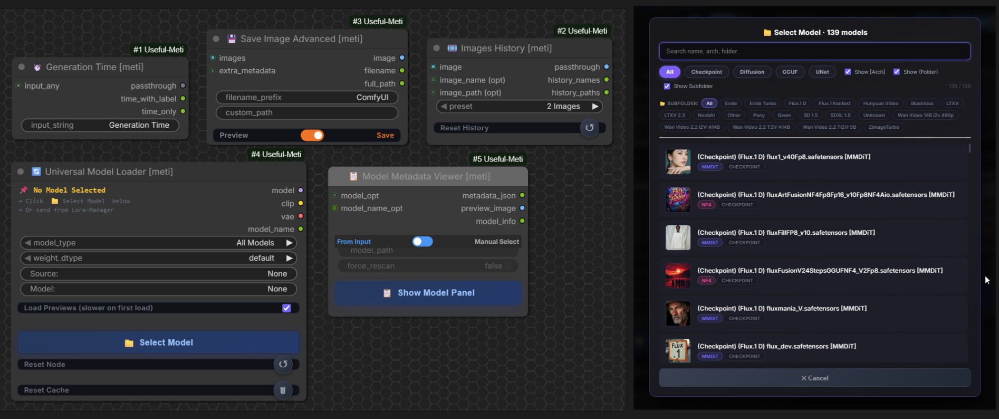
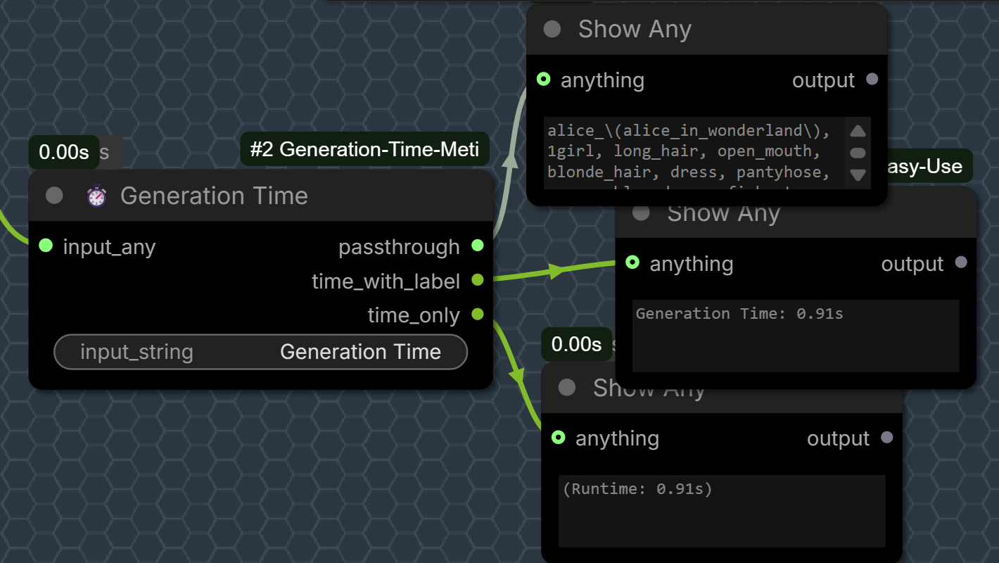
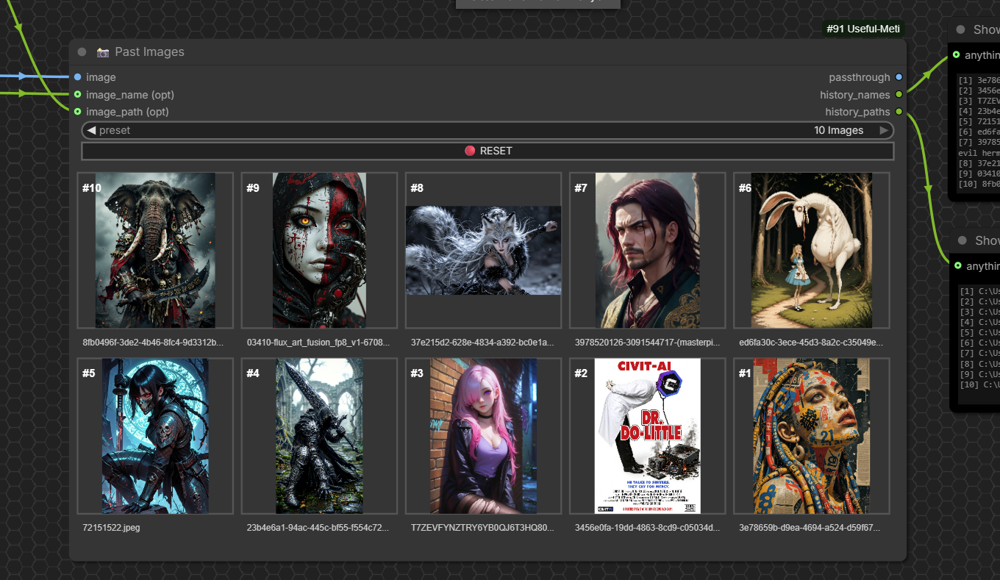
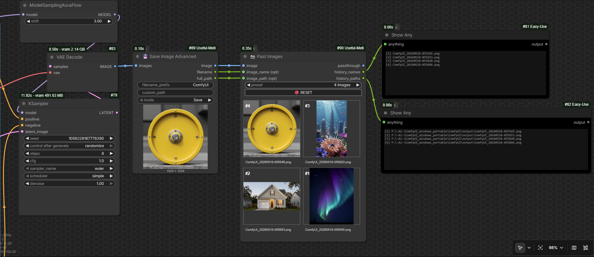
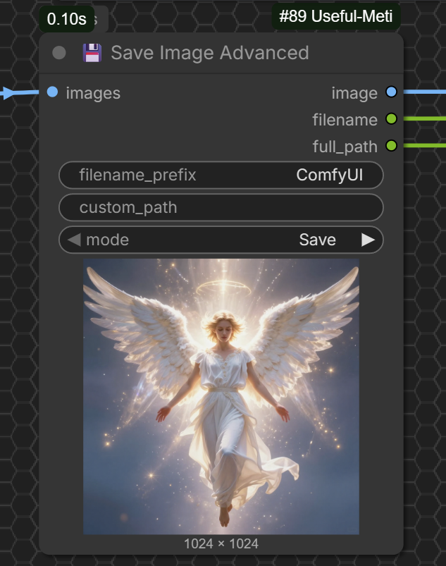
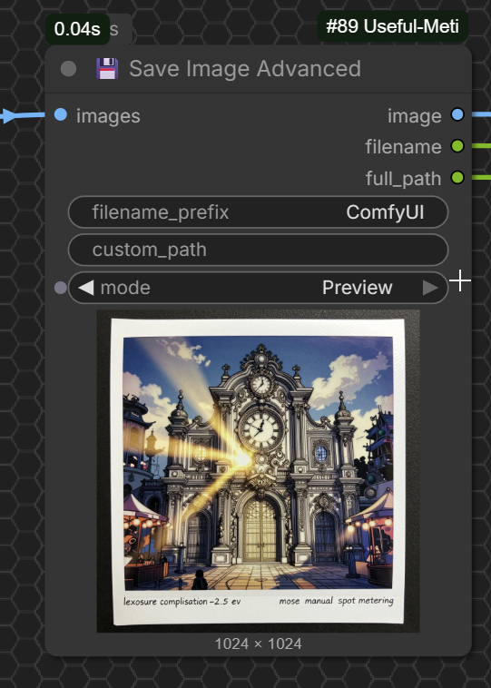

<!-- metadata
title: "Useful-Meti: Timer, Image History & Save Nodes"
description: "Useful custom nodes for ComfyUI by Meti: Outputs the total execution time (Generation Time) of your Nodes or workflow , Keeps a history of your generated images (up to 10) and shows them in a live-updating grid , Saves images with custom path and outputs filename & full path or Just Preview"
tags: timer, image history, save image, generation time, past images, batch save, utility
-->

# 🔧 ComfyUI-Useful-Meti

A collection of practical custom nodes for ComfyUI by Mahdi Sharifi . 

---

## 📦 Nodes

| Node | Description |
| :--- | :--- |
| **⏱️ Generation Time** | Outputs the total execution time of your Nodes or workflow. |
| **📸 Past Images** | Keeps a history of your generated images (up to 10) and shows them in a live-updating grid. |
| **💾 Save Image Advanced** | Saves images with custom path and outputs filename & full path or Just Preview |

<div style="text-align: center;">
  
</div>

> 📸 [View more examples](images/Useful-Meti-02.png)

---

## 🚀 Installation

1. Go to `ComfyUI/custom_nodes/`
2. Clone this repository:
   ```bash
   git clone https://github.com/metixxx/ComfyUI-Useful-Meti.git
   ```
3. Restart ComfyUI

> ✅ No extra dependencies needed. Works with ComfyUI's default environment.

---

## ⚙️ How to Use

> 💡 **Tip:** Hover your mouse over any input field to see a helpful tooltip with usage examples.

### ⏱️ Generation Time

Place it anywhere in your workflow and connect it to any type on Node . Output show the  execution time (Generation Time) of your Nodes or workflow .

<div align="center">
	
| Inputs | Type | Description |
|--------|------|-------------|
| `input_any` | any | Data to pass through unchanged |
| `input_string` | STRING | Label for the time (default: "Generation") |

| Outputs | Type | Example |
|---------|------|---------|
| `passthrough` | any | Your original image/text |
| `time_with_label` | STRING | `"Generation: 2m 34s"` |
| `time_only` | STRING | `"(Runtime: 2m 34s)"` |



Use this node to compare different models, samplers, or schedulers:


	
</div>

> 📸 [View more examples](images/GenerationTime-example03.png)

---

### 📸 Past Images

Keeps a history of your generated images (up to 10) and shows them in a live-updating grid.  
The grid preserves each image's **original aspect ratio** inside the frame, so you can easily compare different outputs.

<div align="center">
	
| Inputs | Type | Description |
|--------|------|-------------|
| `image` | IMAGE | Image batch to store |
| `preset` | INT | 2, 4, 6, 8, or 10 images |
| `image_name (opt)` | any | Optional image name |
| `image_path (opt)` | any | Optional file path |
| `reset_trigger` | BUTTON | Clears all history |
	
</div>

<div align="center">
	
| Outputs | Type | Description |
|---------|------|-------------|
| `passthrough` | IMAGE | Pass-through the input image |
| `history_names` | STRING | List of image names |
| `history_paths` | STRING | List of full file paths |
</div>


 

---

### 💾 Save Image Advanced

Save images with custom path and get filename + full path as output.

| Inputs | Type | Description |
|--------|------|-------------|
| `images` | IMAGE | Image(s) to save |
| `filename_prefix` | STRING | Prefix for the filename |
| `custom_path` | STRING | Custom save directory (leave empty for default ComfyUI output) |
| `mode` | `Save` / `Preview` | `Save` = writes to disk + shows preview, `Preview` = shows preview only |

<div align="center">
	
| Outputs | Type | Description |
|---------|------|-------------|
| `image` | IMAGE | Pass-through the input image |
| `filename` | STRING | Name of the saved file |
| `full_path` | STRING | Full path of the saved file |

<div style="overflow-x: auto; text-align: center;">
  <table style="margin: 0 auto; min-width: 480px;">
    <tr>
      <td align="center" style="padding: 0 15px;">
        
        <br />
        <em>Save Mode</em>
       </td>
      <td align="center" style="padding: 0 15px;">
        
        <br />
        <em>Preview Mode</em>
       </td>
    </tr>
  </table>
</div>
</div>

---

## 🙏 Credits

- **Maintainer:** [Metixxx](https://github.com/metixxx)
- **Inspiration for Generation Time:** [Shannooty/ComfyUI-Timer-Nodes](https://github.com/Shannooty/ComfyUI-Timer-Nodes)

---

## 💖 Support This Project

If you find these nodes useful for your workflows, please consider supporting their continued development.  
Your support helps me add new features, improve documentation, and keep everything up to date.

<div align="center">

| Network | Wallet Address |
| :--- | :--- |
| **BEP20 (USDT)** | `0x7CBf0c5D7ECd5BAcD6BD13b3b2D4e8B3Ca9542AD` |
| **TRC20 (USDT)** | `TT1xEJMPNiBHtdA1pz4bCCxYgBajr1vtT1` |

<br />

<table width="100%" style="max-width: 500px; margin: 0 auto;">
  <tr>
    <td align="center" width="35%">
      
      <br />
      <strong>BEP20</strong>
    </td>
    <td align="center" width="30%">
      •••
    </td>
    <td align="center" width="35%">
      
      <br />
      <strong>TRC20</strong>
     </td>
   </tr>
</table>
</div>

Thank you for any contribution — it truly means a lot! 🙏

---

## ⚖️ License

GPL-3.0. See [LICENSE](LICENSE) file for details.

---

🔗 **GitHub:** [metixxx/ComfyUI-Useful-Meti](https://github.com/metixxx/ComfyUI-Useful-Meti)