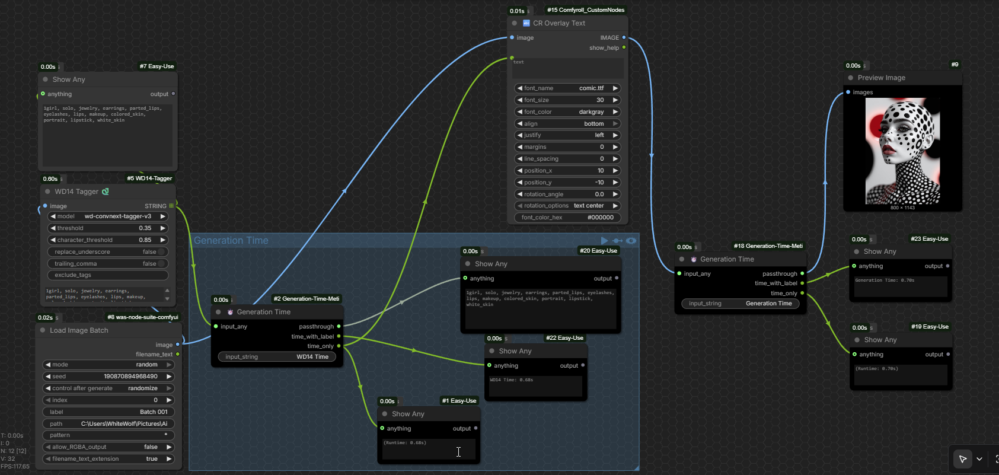

# ⏱️ Generation Time - Meti

A custom node for ComfyUI that outputs the total execution time of your workflow. Based on [Shannooty/ComfyUI-Timer-Nodes](https://github.com/Shannooty/ComfyUI-Timer-Nodes).

## Features

- **Auto Timer:** Timer starts automatically when workflow begins. No need for a separate start node.
- **Place Anywhere:** Can be placed at any position in your workflow - always shows total execution time.
- **Data Passthrough:** Passes any type of data (images, text, etc.) without modification.
- **Two Output Formats:** Provides both labeled time and raw runtime string.

## Installation

1. Navigate to your ComfyUI `custom_nodes` folder:
   
   ComfyUI/custom_nodes/
   
   Clone this repository:
   ```
   git clone https://github.com/metixxx/ComfyUI-Generation-Time.git
   ```

3. Restart ComfyUI

## Usage

After restart, find the node **`⏱️ Generation Time`** under category **`Generation Time - Meti`**

### Node Interface


### Inputs

| Input | Type | Default | Description |
|-------|------|---------|-------------|
| input_any | any | - | Any data (image, text, etc.) - passes through unchanged |
| input_string | STRING | "Generation Time" | Custom label to display before the time |

### Outputs

| Output | Type | Description | Example |
|--------|------|-------------|---------|
| passthrough | any | Same as input_any (for chaining nodes) | Your original image/text |
| time_with_label | STRING | Label + runtime | "Generation: 2m 34s" |
| time_only | STRING | Only runtime | "(Runtime: 2m 34s)" |

## Examples

### Simple Example (End of Workflow)

Place the node at the end of your workflow:

```
[KSampler] ---(image)---> [⏱️ Generation Time] ---(passthrough)---> [Save Image]
                              |
                              ---(time_with_label)---> [Show Text]
```

### Advanced Example (Middle of Workflow)

You can place this node **anywhere** in your workflow. The timer always shows the total execution time from start to finish, regardless of node position.



In the example above, the node is placed after WD14Tagger and CR Overlay Text, but the output still represents the total execution time of the entire workflow.

## Use Cases

- **Performance Monitoring:** Track how long your workflow takes to execute
- **Debugging:** Identify slow sections by placing nodes at different positions
- **Metadata:** Add execution time to generated images or text outputs
- **Batch Processing:** Log processing times for multiple runs


### 🖼️ Compare Generation Time For Model / Sampler / Scheduler

You can use this node to **measure and compare** the generation time of different configurations (models, samplers, schedulers). Simply place the `⏱️ Generation Time` node after your KSampler and connect the `time_only` output to a **Show Text** node, or save the time along with your image.

#### XYZ Grid Comparison with Runtime Text

The image below shows a grid comparison showing how the runtime (`(Runtime: 2m 34s)`) appears under each generated image.
 


This makes it easy to:
- **Compare performance** across different settings
- **Choose the fastest** sampler or scheduler for your workflow
- **Document** which configuration produced which image with its generation time


## Credits

- **Original Project:** [Shannooty/ComfyUI-Timer-Nodes](https://github.com/Shannooty/ComfyUI-Timer-Nodes) - The foundation and core logic
- **Maintainer:** [Metixxx](https://github.com/metixxx/ComfyUI-Generation-Time)

## Repository

🔗 **GitHub:** [https://github.com/metixxx/ComfyUI-Generation-Time-Meti](https://github.com/metixxx/ComfyUI-Generation-Time)

## License

This project is licensed under the same terms as the original ComfyUI-Timer-Nodes repository.


## Support 

If you find this node useful and would like to support further development, you can send a donation via USDT:

### 💰 Tether USDT (BEP20)

**Wallet Address:** `0x7CBf0c5D7ECd5BAcD6BD13b3b2D4e8B3Ca9542AD`


### 💰 Tether USDT (TRC20)

**Wallet Address:** `TT1xEJMPNiBHtdA1pz4bCCxYgBajr1vtT1`


Thank you for your support! 🙏

